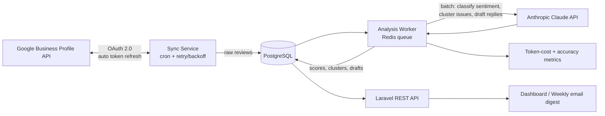

# ReviewSense ⭐

**Review-intelligence pipeline — syncs multi-location Google Reviews and turns them into sentiment trends, issue clusters, and ready-to-send response drafts.**

> Evolved from a production system I built (Red Wolf Reviews: OAuth 2.0 Google Reviews sync, cron + retry pipelines, multi-business analytics) — with a Claude-powered intelligence layer on top.

---

## 🎯 The Outcome

| Problem | Result |
|---|---|
| Owners of multi-location businesses can't read hundreds of reviews/week | Weekly **AI digest**: top praises, top complaints, emerging issues per location |
| Star ratings hide *why* customers are unhappy | **Issue clustering** ("slow check-in", "billing confusion") with trend direction |
| Unanswered reviews hurt local SEO and trust | **Response drafts** in the business's tone, generated for every new review — reply time cut from days to minutes |
| API rate limits break naive sync jobs | Retry-safe, cron-scheduled sync with token refresh — **zero manual re-auth** in production pattern |

## 🏗 Architecture



## 🔑 Key engineering decisions

- **Batch the LLM work.** Reviews are analyzed in batches per cron cycle — 10× cheaper than per-review calls, using Claude's batch-friendly prompting with structured JSON output.
- **Deterministic pipeline, probabilistic step.** Sync, storage, and serving are boring and reliable; only the analysis step is AI — and it's validated, versioned, and re-runnable.
- **Human-in-the-loop replies.** Drafts are never auto-posted; owners approve. Draft acceptance rate is tracked as the success metric.
- **Production-grade OAuth hygiene** — encrypted token storage, refresh-ahead-of-expiry, alerting on repeated auth failures (learned the hard way in production).

## 🛠 Stack

`Laravel 11` · `PostgreSQL` · `Redis queues + cron` · `Google Business Profile API (OAuth 2.0)` · `Anthropic Claude API` · `AWS`

## 📚 What I learned (outcome-based)

- LLM classification is only trustworthy when you can **re-run the whole corpus** after a prompt change — store raw inputs forever, treat analysis as derived data.
- Sentiment scores alone are vanity; **clustered issues with trend direction** are what an owner acts on.
- The reliability patterns from payment/webhook systems (idempotency, retries, dead-letter handling) transfer 1:1 to AI pipelines.

## 🚀 Run it

```bash
cp .env.example .env   # GOOGLE_CLIENT_ID/SECRET, ANTHROPIC_API_KEY, DB creds
composer install && php artisan migrate
php artisan schedule:work &   # sync + analysis crons
php artisan serve
```

---
*Part of my AI-enabled backend portfolio: [TripBrief AI](../tripbrief-ai) · [CRM Copilot](../crm-copilot)*
